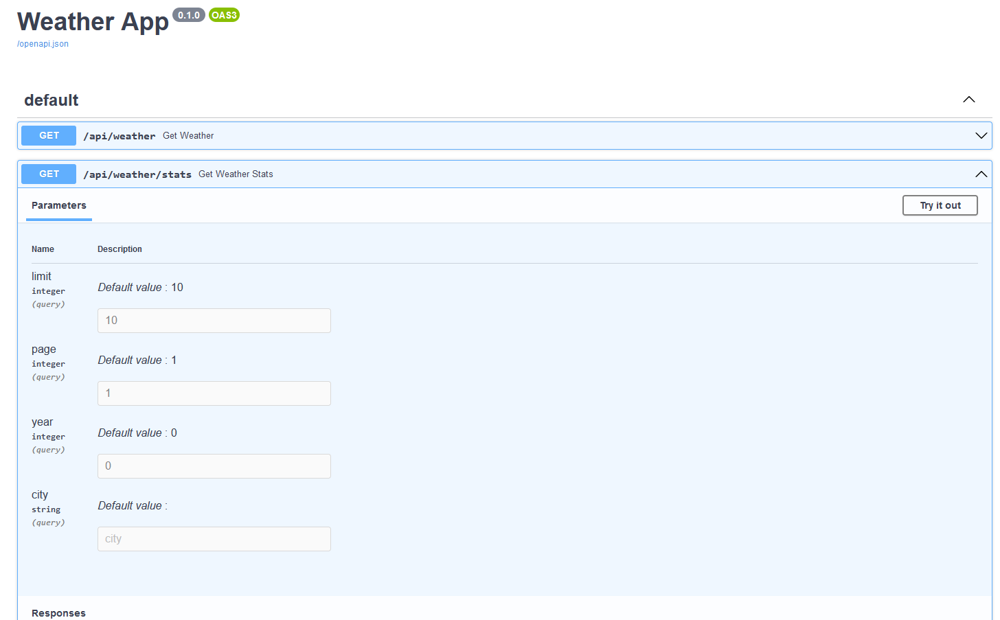

# Code Challenge Template

# Problem 1 - Data Modeling
Refer `answers\db.sql`

# Solution 2 - Ingestion: 
- run `python .\src\import.py <path of directory>`
- e.g. `python .\src\import.py 'D:\Codes\weather\wx_data'`

  
# Solution 3  - Data Analysis: 
- run `python .\src\analysis.py`

  

# Solutions 4 - REST API & Swagger
- run `uvicorn rest:app --reload` from `src` directory
 

- visit http://127.0.0.1:8000/docs for Swagger API documentation
  

# Docker Setup
- run `docker build -t weatherapp .` from `src` directory
- than run `docker run -d --name weather -p 80:80 weatherapp`

# Deployment
For deployment we directly move our docker container to ECR and than deploy an ECS container from it. 